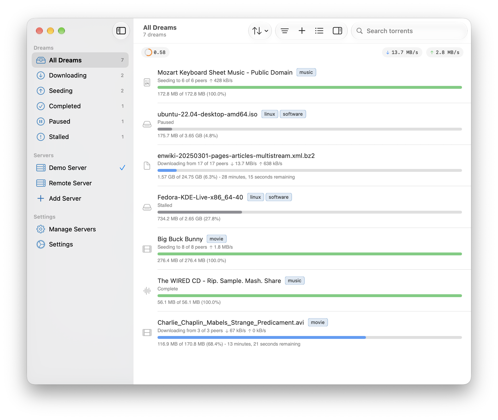
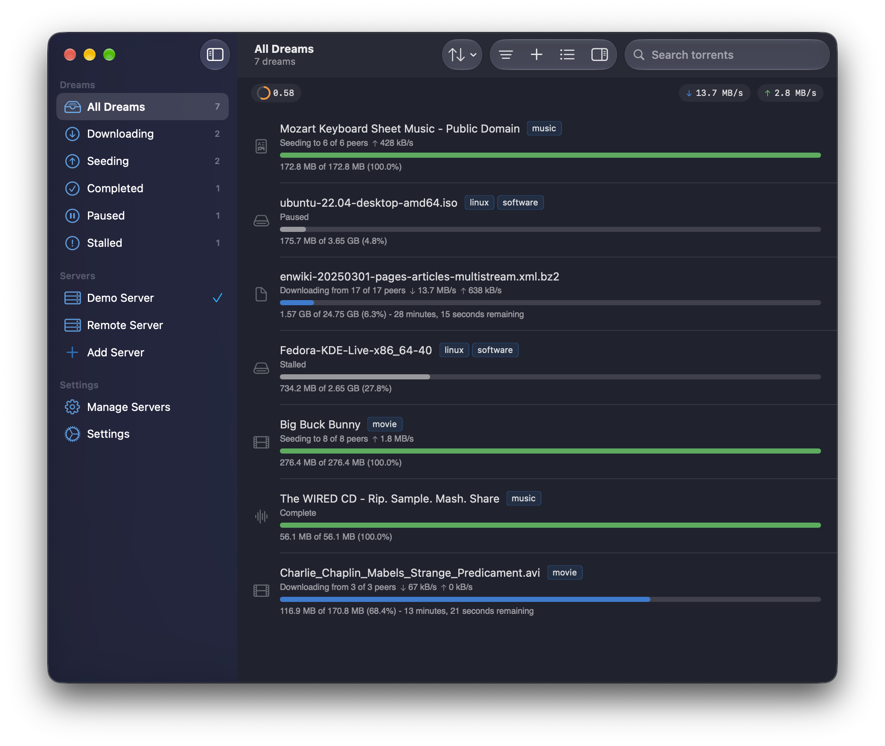

<h1 align="center">
  
   BitDream
</h1>

BitDream is a native and feature-rich remote control client for Transmission web server. It provides a modern, seamless interface to manage your Transmission server from anywhere.

  
  

## Features

- Fully native apps for both macOS and iOS
- Remote management of Transmission server
- Real-time torrent status monitoring
- Add, remove, and manage torrents remotely
- View detailed torrent information and statistics
- Secure connection to Transmission's RPC interface
- Built-in Tailscale integration for private connections to your Transmission servers

## Tailscale

Sign in to Tailscale directly in BitDream on macOS and iOS. When adding or editing a server, choose **Tailscale** under **Connect using**, sign in, and select a machine.

Your Transmission server must already be accessible through Tailscale, with remote access (RPC) enabled.

## About Transmission

[Transmission](https://transmissionbt.com/) is a fast, easy, and free BitTorrent client for macOS, Windows, and Linux.

BitDream connects to Transmission's RPC (Remote Procedure Call) interface, allowing you to control your Transmission server from anywhere. For more information about Transmission's RPC specification, see the [official documentation](https://github.com/transmission/transmission/blob/main/docs/rpc-spec.md).
